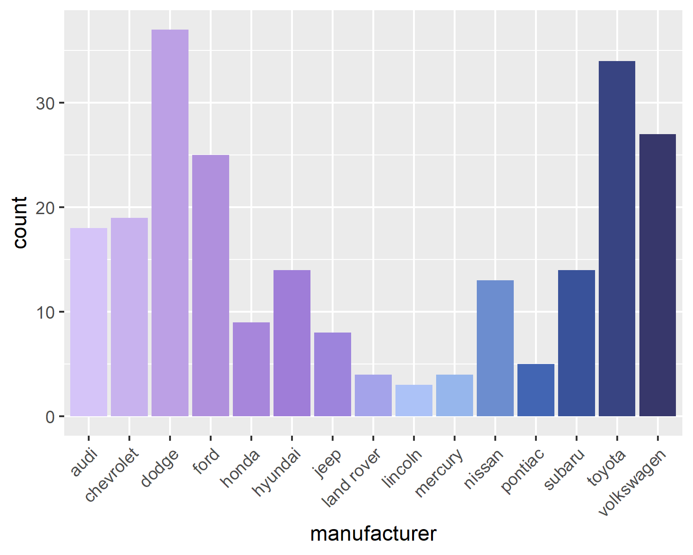

# bluepally
Use colour palettes in ggplot2 based on fresh and delicious blueberries!

The gradient is based on this picture


(https://www.reddit.com/r/mildlyinteresting/comments/nr14oh/the_gradient_this_clump_of_blueberries_makes/)

I used https://html-color-codes.info/colors-from-image/ for extracting the colors.

## Installation
Install via GitHub:

``` r
devtools::install_github("manucarl/bluepally")
```

## Examples

```r
library(bluepally)
library(ggplot2)

blueberry_colors

ggplot(faithfuld, aes(waiting, eruptions, fill = density)) +
 geom_raster() +
 scale_x_continuous(NULL, expand = c(0, 0)) + 
 scale_y_continuous(NULL, expand = c(0, 0)) + 
 theme_void()+
 theme(legend.position = "none")+
 scale_fill_blueberry(discrete=F)
```


``` r


ggplot(iris, aes(Sepal.Width, Sepal.Length, color = Species)) +
 geom_point(size = 4) +
 scale_color_blueberry(palette="blue", reverse = TRUE)
```


``` r
ggplot(mpg, aes(manufacturer, fill = manufacturer)) +
 geom_bar() +
 theme(axis.text.x = element_text(angle = 45, hjust = 1)) +
 scale_fill_blueberry( guide = "none")
```


